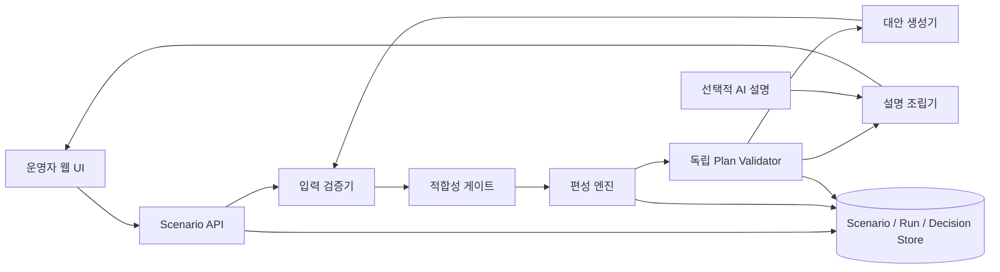

# 05. 아키텍처 구성도

> 버전: v1.0 · 기준일: 2026-08-10 · 상태: **구현 아키텍처 최종본**

## 1. 목표

UI, 입력 검증, 제약 기반 배정, 독립 검증, 대안 생성과 설명을 분리해, 목업 데이터가 실제 데이터로 교체되더라도 핵심 제약 계약이 유지되게 한다.

## 2. 구성도

## 3. 계층별 책임

| 계층 | 책임 | 하면 안 되는 일 |
| --- | --- | --- |
| UI | 입력 확인, 배정표·지도·화차 배치 표시, 결정 입력 | 제약 판정 또는 값 임의 보정 |
| Scenario API | 버전된 시나리오·실행·결정의 흐름 관리 | 편성 규칙을 화면에 중복 구현 |
| 입력 검증기 | 스키마·단위·참조·시간 관계 확인 | 누락 운영값 추정 |
| 적합성 게이트 | 명백히 불가능한 후보쌍 제거 | 용량 경합의 최종 선택 |
| 편성 엔진 | 하드 제약 충족 배정안 계산 | 정책·주문 값 변경 |
| Plan Validator | 엔진과 독립적으로 결과 재검산 | 솔버 내부 함수의 단순 재사용 |
| 대안 생성기 | 허용된 변경의 파생 시나리오 생성 | 안전·규격·중량 제약 완화 |
| 설명 조립기 | 구조화된 상태·사유를 문장·카드로 변환 | 새 수치·확률·원인 생성 |

## 4. 권장 구현 구성

| 영역 | MVP 권장안 | 비고 |
| --- | --- | --- |
| 프론트엔드 | Next.js + TypeScript | 표·필터·지도·배치 UI |
| API | Python + FastAPI + Pydantic | 데이터 계약·검증 |
| 편성 엔진 | OR-Tools CP-SAT | MVP의 유일한 배정 엔진. 그리디 fallback은 사용하지 않음 |
| 저장 | SQLite + SQLAlchemy | 데모 후 PostgreSQL 이관 가능 |
| 테스트 | pytest | contract, rule, solver, validator, API |

## 5. AI 사용 경계

생성형 AI는 선택 사항이다. 사용한다면 `explanation_bundle`처럼 이미 검증된 JSON만 입력으로 받고, 주문 ID·상태·사유·수치가 원본 결과와 일치하는지 검사한다. AI가 없어도 정형 템플릿 설명과 전체 데모는 동작해야 한다.

## 6. 데이터 흐름

1. UI가 목업 데이터로 시나리오 생성을 요청한다.
2. 검증기는 오류 주문을 격리하고 정상 주문의 후보를 만든다.
3. 편성 엔진은 기본 운행 집합 안에서만 배정한다.
4. 독립 검증기가 배정·상태·사유를 재검산한다.
5. 통과한 결과만 UI에 표시하고, 대안은 새 시나리오로 다시 1단계부터 실행한다.
6. 운영자의 채택·보류·반려는 실행 결과와 함께 저장한다.

## 7. 실행·재현성 계약

- API는 시나리오 입력을 정규화하고, CP-SAT는 `random_seed = 7`, `num_search_workers = 1`로 실행한다.
- 실행 결과는 `solver_parameters`, `input_snapshot_sha256`, `policy_sha256`, `result_sha256`을 함께 보존하고 export한다.
- 목적함수는 `배정 건수 최대 → 우선순위 점수 최대 → 납기 시각 최소 → 주문·슬롯 사전순`으로 단계별 고정한다.
- `Plan Validator`는 솔버와 다른 모듈에서 중복 배정, 시간, 규격·중량·터미널, 기본 운행 범위, 상태 계산을 재검산한다.
- 검증 실패·솔버 오류·미확정 상태는 UI가 채택을 허용하지 않는다. 특히 `FEASIBLE + PASS`는 비교·보류는 가능하지만 `ACCEPTED`는 불가하다.
- 성공 대안은 원 실행과 파생 실행의 차이를 `assignment_deltas`로 반환한다. 허용 범위에서 대안이 없으면 `NO_FEASIBLE_ALTERNATIVE`, 금지 변경 요청은 `POLICY_VIOLATION`으로 구분한다.
