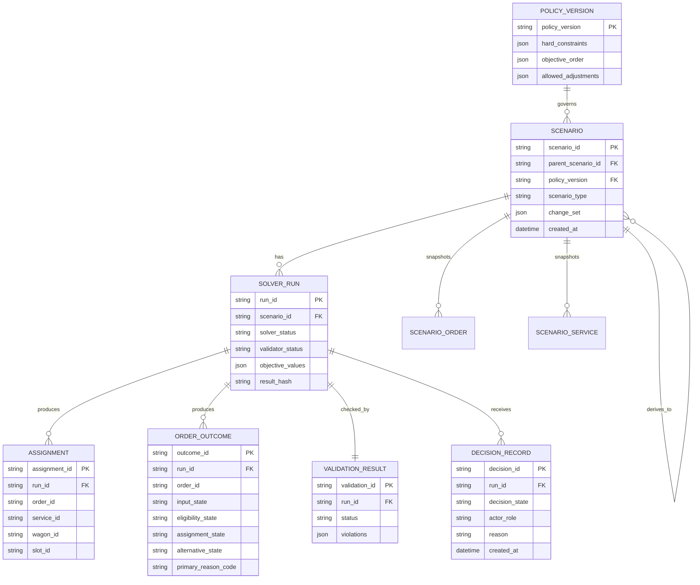

# 06. 저장 모델·ERD

> 버전: v1.0 · 기준일: 2026-08-10 · 상태: **영속 모델 최종본**

## 1. ERD

## 2. 테이블 역할

| 테이블 | 역할 | 변경 원칙 |
| --- | --- | --- |
| `scenario` | 입력·가정·기준 운행의 스냅샷 | 수정하지 않고 새 버전 생성 |
| `policy_version` | 제약·목적함수·대안 범위 | 버전 고정 후 결과와 연결 |
| `solver_run` | 솔버 설정·종료 상태·목적값 | 실행마다 새 행 |
| `assignment` | 주문-운행-화차-슬롯 배정 | 실행 결과에 종속 |
| `order_outcome` | 상태 축·사유·증거·다음 조치 | 실행 결과에 종속 |
| `validation_result` | 독립 검증 결과 | 실행당 하나 이상 |
| `decision_record` | 운영자 결정과 근거 | 결과를 바꾸지 않고 기록 |

## 3. 핵심 무결성 규칙

- `assignment`의 `(run_id, order_id)`는 유일하다.
- `assignment`의 `(run_id, slot_id)`는 유일하다.
- `order_outcome`은 대상 주문마다 실행당 하나다.
- `SCENARIO`의 `parent_scenario_id`가 있으면 `change_set`은 비어 있으면 안 된다.
- `decision_record.decision_state = ACCEPTED`이면 해당 `solver_run.solver_status = OPTIMAL`과 `validator_status = PASS`가 모두 충족되어야 한다.
- `solver_run`은 `parameters_json`, 입력·정책·결과 hash를 모두 보존한다.
- 기본 시나리오의 배정은 `baseline_service_ids` 밖의 서비스 ID를 참조할 수 없다.

## 4. 최소 JSON 보존 필드

초기 MVP에서는 개별 스냅샷 테이블을 모두 정규화하지 않아도 된다. 단, `scenario.input_snapshot`, `policy_version.definition`, `order_outcome.evidence`, `scenario.change_set`은 JSON으로 보존해 실행을 재현할 수 있어야 한다.

## 5. 실제 물리 스키마

| 테이블 | PK | 필수 열 | FK/제약 |
| --- | --- | --- | --- |
| `scenario` | `scenario_id` | `parent_scenario_id`, `policy_version`, `type`, `baseline_service_ids_json`, `input_snapshot_json`, `change_set_json` | 부모가 있으면 `change_set_json` 필수 |
| `policy_version` | `policy_version` | `definition_json`, `approved_at` | 결과가 참조한 정책은 수정 금지 |
| `solver_run` | `run_id` | `scenario_id`, `solver_status`, `validator_status`, `parameters_json`, `input_snapshot_hash`, `policy_hash`, `objective_json`, `result_hash` | `scenario_id` FK |
| `assignment` | `assignment_id` | `run_id`, `order_id`, `service_id`, `wagon_id`, `slot_id` | `(run_id, order_id)`, `(run_id, slot_id)` 유일 |
| `assignment_delta` | `delta_id` | `alternative_run_id`, `order_id`, `change_type`, `before_assignment_json`, `after_assignment_json` | 대안 성공 시 영향 주문마다 1건 |
| `order_outcome` | `outcome_id` | `run_id`, `order_id`, 다섯 상태 축, `primary_reason_code`, `evidence_json` | `(run_id, order_id)` 유일 |
| `validation_result` | `validation_id` | `run_id`, `status`, `violations_json` | `run_id` FK |
| `decision_record` | `decision_id` | `run_id`, `decision_state`, `actor_role`, `reason`, `created_at` | `ACCEPTED`는 PASS 실행만 허용 |

`Order`, `Service`, `Wagon`, `Slot`, `Terminal`은 `scenario.input_snapshot_json` 안에 원본 그대로 보관한다. MVP에서 이것들을 별도 전역 마스터 테이블로 만들면 가정 변경이 과거 실행을 바꿀 위험이 있다.
